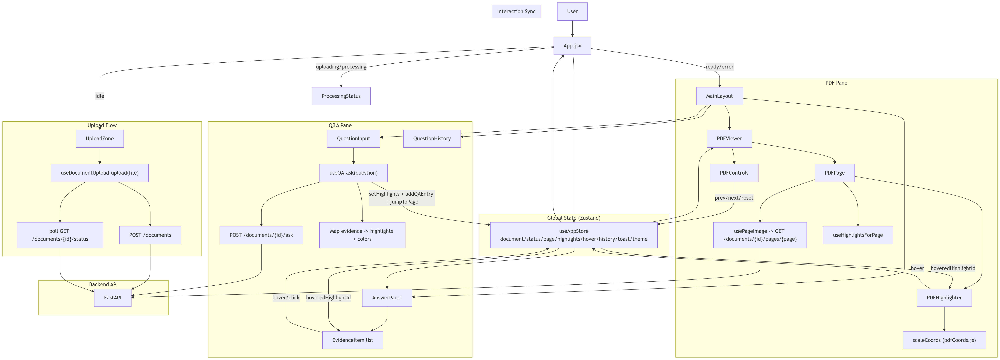

# Page-Proof-QA Frontend

Frontend application for document question answering with grounded evidence highlights.

The UI lets a user:
- Upload a PDF
- See true upload progress, then backend processing state
- Ask a question about the document
- See the answer plus evidence snippets
- Jump to evidence on the rendered page
- Hover-sync highlights between chat evidence and PDF overlays
- Zoom PDF pages while keeping highlight alignment
- Resize the desktop PDF/chat divider and switch panes on mobile

## What This Frontend Owns
- User flow and interaction design
- Document upload/polling UX
- Question input and Q/A history display
- Evidence rendering and highlight overlay behavior
- Coordinate scaling from PDF-space to rendered image-space
- Responsive layout behavior (mobile pane switch + desktop resizable split)
- Client-side PDF zoom controls

The backend owns extraction, retrieval, answer generation, and bounding boxes.

## Tech Stack
- React 19 + Vite
- TanStack Query
- Zustand for app state
- Axios for API calls
- Tailwind CSS (v4) for styling
- Lucide icons

## High-Level Flow
1. User uploads a PDF.
2. Frontend calls `POST /documents` and tracks byte upload progress.
3. Frontend switches to the document workspace only after upload succeeds, then polls `GET /documents/{id}/status` until `ready`.
4. User asks a question.
5. Frontend calls `POST /documents/{id}/ask`.
6. Frontend maps evidence into highlight objects (with colors).
7. Frontend jumps to first evidence page and overlays bbox highlights.
8. Hover in chat or PDF keeps both sides visually in sync.

## Frontend Architecture


## API Contract Used by Frontend
- `POST /documents` -> `{ document_id }`
- `GET /documents/{document_id}/status` -> `{ status, total_pages, page_width, page_height, error_message }`
- `GET /documents/{document_id}/pages/{page}` -> page PNG image
- `POST /documents/{document_id}/ask` -> `{ answer, evidence: [{ page, text, bbox, page_width?, page_height? }] }`

All endpoints are called from `src/services/api.js`.

## Environment
Create `frontend/.env`:

```bash
VITE_API_URL=http://localhost:8080
```

Copy/paste template:

```dotenv
VITE_API_URL=http://localhost:8080
```

Notes:
- If backend runs on another host/port, update `VITE_API_URL`.
- For self-hosted Nginx reverse proxy mode (`infra/nginx/app.conf`), use `VITE_API_URL=/api`.
- `vite.config.js` also has a proxy for `/documents`, but `api.js` uses `VITE_API_URL` directly by default.

## Run Frontend
Prerequisites:
- Node.js 20+ recommended
- npm

Steps:

```bash
cd frontend
npm install
npm run dev
```

Default local URL:
- `http://localhost:5173`

Other scripts:

```bash
npm run build
npm run preview
npm run lint
```

## Recommended Full Local Run
1. Start backend first (health should respond on `http://localhost:8080/health`).
2. Start frontend with `npm run dev`.
3. Open `http://localhost:5173`.
4. Upload a PDF and ask questions.

## Project Structure

```text
frontend/
  public/
    favicon.svg                  # App icon
  src/
    App.jsx                      # Top-level app shell and state-based screen switching
    main.jsx                     # React bootstrap + QueryClientProvider
    index.css                    # Global styles
    theme.config.js              # Centralized light/dark palette + highlight colors

    layouts/
      MainLayout.jsx             # Responsive shell: mobile pane switch + desktop resizable split

    services/
      api.js                     # Axios client + backend API functions

    store/
      useAppStore.js             # Global Zustand store and actions

    hooks/
      useDocumentUpload.js       # Upload + polling lifecycle
      useQA.js                   # Ask question flow + highlight mapping
      usePageImage.js            # Page image URL helper
      useHighlights.js           # Highlights filtered by page
      useTheme.js                # Theme selector helper

    utils/
      pdfCoords.js               # PDF bbox -> rendered image coordinate scaling
      highlightColors.js         # Highlight color assignment

    components/
      upload/
        UploadZone.jsx           # Drag/drop upload area
        ProcessingStatus.jsx     # Upload/processing progress state UI
      pdf/
        PDFViewer.jsx            # PDF container with controls + page display
        PDFControls.jsx          # Prev/next page + zoom controls + reset/new-doc action
        PDFPage.jsx              # Page image load + zoom scaling + overlay mount
        PDFHighlighter.jsx       # Absolute positioned bbox overlays
      qa/
        QuestionInput.jsx        # Question textarea + submit action
        AnswerPanel.jsx          # Current answer and evidence list
        EvidenceItem.jsx         # Evidence card with jump + hover-sync behavior
        QuestionHistory.jsx      # Collapsible older Q/A entries
      ui/
        Button.jsx               # Shared button styles
        Badge.jsx                # Shared badge styles
        Spinner.jsx              # Loading indicator
        Toast.jsx                # Toast notifications
        ThemeToggle.jsx          # Light/dark mode toggle
  vite.config.js                 # Dev server config and proxy
  package.json                   # Scripts and dependencies
```

## State Model (Zustand)
Main store fields in `src/store/useAppStore.js`:
- Document: `documentId`, `documentStatus`, `totalPages`, `pageWidth`, `pageHeight`, `uploadProgress`
- Navigation: `currentPage`, `pdfZoom`
- Evidence/interaction: `highlights`, `activeHighlightPage`, `hoveredHighlightId`
- Q/A history: `qaHistory`
- UI: `toast`, `theme`

Persistence policy:
- Only `theme` is persisted.
- Document and Q/A session state reset on new document.
- Desktop split ratio is stored in localStorage (`pageproof-layout-split-ratio`).

## Highlight System
- Backend sends bbox in PDF point coordinates.
- Frontend scales bbox using `scaleCoords(...)` in `src/utils/pdfCoords.js`.
- Overlay is rendered in `PDFHighlighter.jsx` as absolute-positioned boxes.
- Hover synchronization uses shared `hoveredHighlightId`:
  - Hover evidence card -> highlight becomes active
  - Hover highlight box -> matching card reflects active state

## Error Handling and UX Behavior
- Upload validation: PDF only
- Real upload progress from Axios `onUploadProgress`
- Poll timeout with user feedback
- Backend connection errors displayed via toast
- Upload failure returns user to upload screen (no accidental layout advance)
- Ask-button disabled unless document is ready
- On successful answer, app auto-jumps to first evidence page
- Desktop divider can be dragged to resize PDF/chat panes (ratio persisted locally)
- Mobile uses explicit `Document` / `Q&A` pane switching
- Q&A pane has its own scroll container for long conversations/evidence lists
- Zoom controls support 50%-300% with Ctrl+wheel shortcut

## Key Frontend Decisions
1. Server-rendered page images instead of in-browser PDF parsing.
Reason: keeps extraction/display aligned with backend span coordinates and avoids browser PDF parsing complexity.

2. Centralized app state via Zustand.
Reason: highlight sync, page navigation, Q/A history, and toasts need shared cross-component state with low boilerplate.

3. Theme driven from a single config file.
Reason: visual consistency and fast global retheming from `theme.config.js`.

4. Evidence highlighting is data-driven from backend bbox.
Reason: frontend should not guess evidence locations; it only maps/visualizes grounded backend coordinates.

5. Manual polling for document readiness.
Reason: simple and robust for current workflow without introducing websocket complexity.

6. Keep frontend logic thin on retrieval/QA semantics.
Reason: model/retrieval/evidence confidence belongs in backend; frontend remains a deterministic renderer and interaction layer.

## Future Improvements
- Virtualized rendering for very large evidence lists
- Better loading skeletons for page/image transitions
- E2E tests for upload -> ask -> jump -> hover-sync flow
- Optional real-time progress updates via SSE/WebSocket
